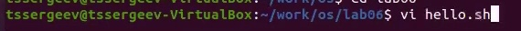
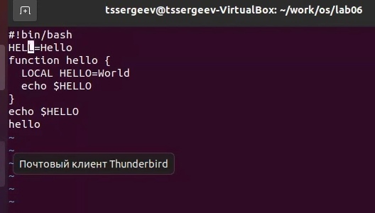
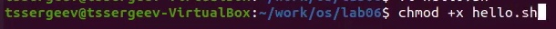
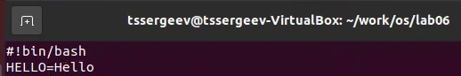
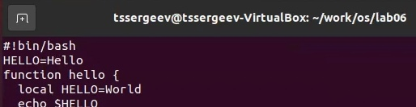
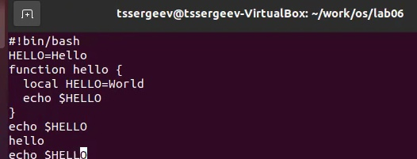

# Отчёт по лабораторной работе №9
## Текстовой редактор *vi*

---

## Цель выполнения лабораторной работы

Познакомиться с операционной системой Linux. Получить практические навыки работы с редактором vi, установленным по умолчанию практически во всех дистрибутивах.

---

## Задачи выполнения лабораторной работы

1. Ознакомиться с теоретическим материалом.

2. Ознакомиться с редактором vi.

3. Выполнить упражнения, используя команды vi.

---

## Задание 1. Создание нового файла с использованием vi

---

## Задание 2. Редактирование существующего файла
 
 

---
## Вывод

В ходе выполнения поставленных задач я продолжил знакомство с операционной системой Linux, а именно получил практические навыки работы с редактором vi, установленным по умолчанию практически во всех дистрибутивах.

---

# ***Спасибо за внимание!***

