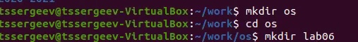
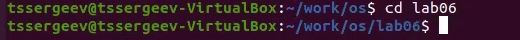
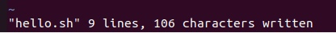
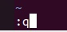
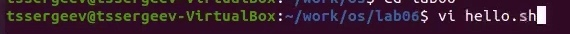
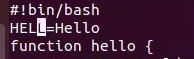
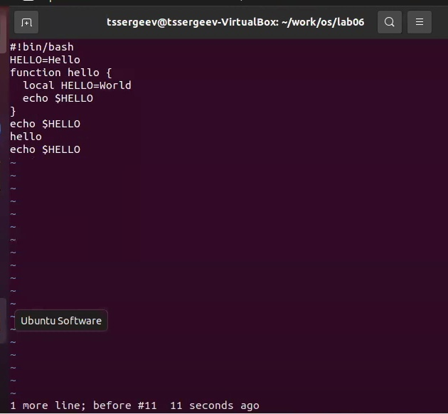
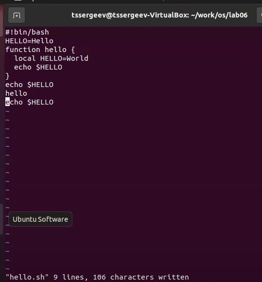

---
# Front matter
lang: ru-RU
title: "Отчет по лабораторной работе №9"
subtitle: "Дисциплина: операционные системы"
author: "Сергеев Тимофей Сергеевич"

# Formatting
toc-title: "Содержание"
toc: true # Table of contents
toc_depth: 2
lof: true # List of figures
lot: true # List of tables
fontsize: 12pt
linestretch: 1.5
papersize: a4paper
documentclass: scrreprt
polyglossia-lang: russian
polyglossia-otherlangs: english
mainfont: PT Serif
romanfont: PT Serif
sansfont: PT Sans
monofont: PT Mono
mainfontoptions: Ligatures=TeX
romanfontoptions: Ligatures=TeX
sansfontoptions: Ligatures=TeX,Scale=MatchLowercase
monofontoptions: Scale=MatchLowercase
indent: true
pdf-engine: lualatex
header-includes:
  - \linepenalty=10 # the penalty added to the badness of each line within a paragraph (no associated penalty node) Increasing the value makes tex try to have fewer lines in the paragraph.
  - \interlinepenalty=0 # value of the penalty (node) added after each line of a paragraph.
  - \hyphenpenalty=50 # the penalty for line breaking at an automatically inserted hyphen
  - \exhyphenpenalty=50 # the penalty for line breaking at an explicit hyphen
  - \binoppenalty=700 # the penalty for breaking a line at a binary operator
  - \relpenalty=500 # the penalty for breaking a line at a relation
  - \clubpenalty=150 # extra penalty for breaking after first line of a paragraph
  - \widowpenalty=150 # extra penalty for breaking before last line of a paragraph
  - \displaywidowpenalty=50 # extra penalty for breaking before last line before a display math
  - \brokenpenalty=100 # extra penalty for page breaking after a hyphenated line
  - \predisplaypenalty=10000 # penalty for breaking before a display
  - \postdisplaypenalty=0 # penalty for breaking after a display
  - \floatingpenalty = 20000 # penalty for splitting an insertion (can only be split footnote in standard LaTeX)
  - \raggedbottom # or \flushbottom
  - \usepackage{float} # keep figures where there are in the text
  - \floatplacement{figure}{H} # keep figures where there are in the text
---

# Цель работы

Познакомиться с операционной системой *Linux*. Получить практические навыки работы с редактором *vi*, установленным по умолчанию практически во всех дистрибутивах.

# Выполнение лабораторной работы

* *Редактор vi - универсальный полноэкранный текстовый редактор в среде UNIX. Его универсальность означает то, что, во-первых, этот редактор имеется во всех UNIX-подобных ОС и, во-вторых, то, что этот редактор работает практически с любыми видами терминалов (ANSI, VT100, VT220, VT320, DEC, и т.п.).* 

* **Задание 1. Создание нового файла с использованием *vi***

1. Создайте каталог с именем *~/work/os/lab06*.

*Рисунок 1:*

 

2. Перейдите во вновь созданный каталог.

*Рисунок 2:*

 

3. Вызовите *vi* и создайте файл *hello.sh*
>     vi hello.sh

*Рисунок 3:*

 

4. Нажмите клавишу *i* и вводите следующий текст.

>     #!/bin/bash
>     ELL=Hello
>     function hello 
>      {    
>          LOCAL HELLO=World
>          echo $HELLO
>     }
>     echo $HELLO
>     hello

*Рисунок 4:*

 

5. Нажмите клавишу *Esc* для перехода в командный режим после завершения ввода
текста.

6. Нажмите "**:**" для перехода в режим последней строки и внизу вашего экрана
появится приглашение в виде двоеточия.

7. Нажмите *w* (записать) и *q* (выйти), а затем нажмите клавишу *Enter* для сохранения вашего текста и завершения работы.
   
*Рисунок 5:*

 

*Рисунок 6:*

 

*Рисунок 7:*

 

8. Сделайте файл исполняемым:
>     chmod +x hello.sh

*Рисунок 8:*

 

* **Задание 2. Редактирование существующего файла**

1. Вызовите vi на редактирование файла
>     vi ~/work/os/lab06/hello.sh

*Рисунок 9:*

 

2. Установите курсор в конец слова *HELL* второй строки.

*Рисунок 10:*

 

3. Перейдите в режим вставки и замените на *HELLO*. Нажмите *Esc* для возврата в
командный режим.

*Рисунок 11:*

 

4. Установите курсор на четвертую строку и сотрите слово *LOCAL*.

*Рисунок 12:*

 

5. Перейдите в режим вставки и наберите следующий текст: *local*, нажмите *Esc*
для возврата в командный режим.

*Рисунок 13:*

 

6. Установите курсор на последней строке файла. Вставьте после неё строку, содержащую следующий текст: *echo $HELLO*.

*Рисунок 14:*

 

7. Нажмите *Esc* для перехода в командный режим.

8. Удалите последнюю строку (С помощью команды *d*+*d*).

*Рисунок 15:*

 

9.  Введите команду отмены изменений *u* для отмены последней команды.

*Рисунок 16:*

 

10. Введите символ : для перехода в режим последней строки. Запишите произведённые изменения и выйдите из *vi*.

*Рисунок 17:*

*Рисунок 18:*

 

# Контрольные вопросы

1. Редактор *vi* имеет два режима работы - режим команд и режим редактирования. Запускается он в командном режиме, так что все нажатия на клавиши трактуются как команды. Нажатие клавиш *i*, *a*, *o*, *O* и ряд других переводят *vi* в режим вставки, когда набираемые символы трактуются как текст и отображаются на экране.
2. С помощью *q!*
3.  
– *0* (ноль) — переход в начало строки;

– *$* — переход в конец строки;

– *G* — переход в конец файла;

– *n G* — переход на строку с номером *n*.

4. Редактор *vi* предполагает, что слово - это строка символов, которая может включать в себя буквы, цифры и символы подчеркивания.
5. С помощью команд позициионирования.
6.  Команды редактирования:

-Вставка текста

-Вставка строки

-Удаление текста

-Отмена и повтор произведённых изменений

-Копирование текста в буфер

-Вставка текста из буфера

-Замена текста

-Поиск текста

7. Начать работу в режиме вставки, после чего либо напечать эти символы, либо скопировать.
8. Команда *u*.
9. Копирование и перемещение текста, запись в файл и выход из редактора.
10. Команда *$* - переход в конец строки.

# Выводы
В ходе выполнения поставленных задач я продолжил знакомство с операционной системой Linux, а именно получил практические навыки работы с редактором vi, установленным по умолчанию практически во всех дистрибутивах.

# Библиотека
* https://docs.altlinux.org
* https://neoserver.ru
* https://linuxvsem.ru
* http://rus-linux.net